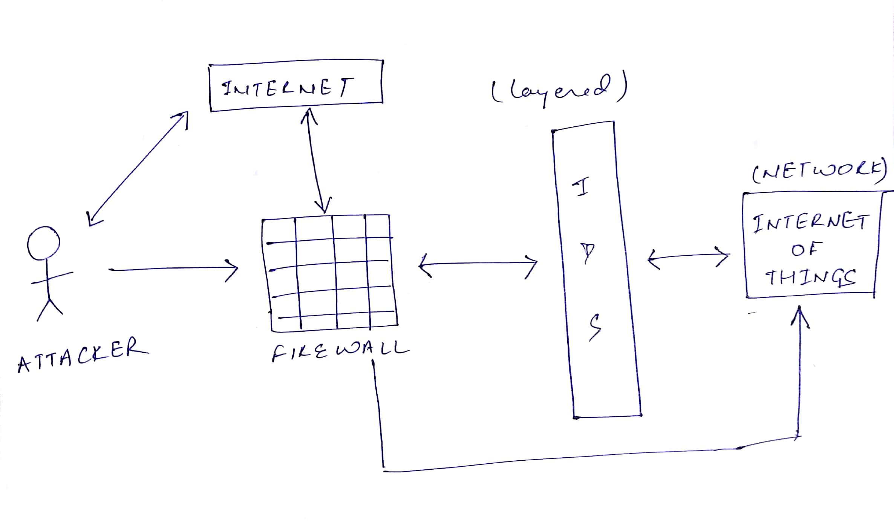
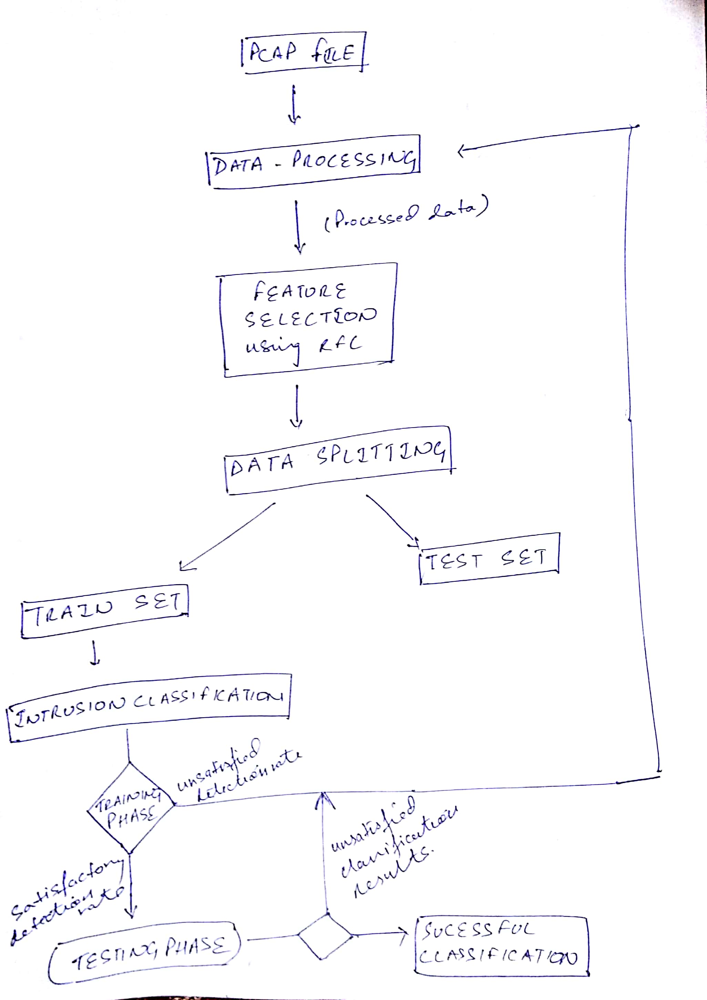

# Intrusion-Detection-System-for-the-Internet-of-Things

The intrusion detection system plays an important role in securing our system, by preventing it from intruders. The system must be accurate in detecting attacks with the minimum number of false alarms. Techniques of Machine Learning, Data Analytics, and Deep Learning are already improving the network efficiency by analyzing the huge amounts of IoT data. However, traditional intrusion detection, such as user authentication, encryption, and firewall have failed to completely protect networks and systems from the increasing and sophisticated attacks and malware. Following with which, the presented new method classifies network behavior as 'normal' or 'abnormal' while reducing misclassification.

## Approach

As many research efforts have been made about IoT security challenges, we here mainly focus on addressing security challenges in the IoT and building a light-weight Intrusion Detection System. Our approach will provide a layer of defense which monitors network traffic for predefined suspicious activity or patterns, and alert system administrators when potential hostile traffic is detected.

### Architecture

A snippet of the data preparation file has been provided along with a template to perform machine learning techniques on the dataset. 

After examining, the ways of improving the IoT architecture, in this project, we propose not to build the IDS as the firewall for the whole IOT setting, but rather to implement three different Intrusion Detection Systems at the respective TCP/IP Layer, Network Layer and Application Layer based on the malware attacks that occur at each layer. This can be done by pre-processing the PCAP/TCPDUMP file accordingly.

### Problem Statement

* What are the current Security and Privacy concerns related to the Internet of things?
* Would it be efficient to build an Intrusion Detection System for each layer of the IOT rather than the traditional methods where we build one IDS for the whole IOT architecture?
* Would it be a better choice to use Neural Networks out of all Machine Learning algorithms to implement a light-weight Intrusion Detection System for the IOT setting?

## Implementation

### All Data is Same

It doesn’t matter what the person is predicting say the movie rating or the price of a house. The data for any machine learning application whatsoever is still a matrix where the number of samples goes along the rows and the features go along the column. The features further are still categorical or numerical. It doesn’t matter what their meaning is. It does not matter if they are the attributes of a house or the attributes of a movie. They could just be looked upon as the symbol of numbers and you'd know what to do with them. This approach lets this project predict the evaluation metrics on any publicly available PCAP/TCPDUMP file.

Once you get the satisfactory results, you could compare the evaluation metrics between the layers of the IOT Architecture or compare them with the previous literature. You could also understand the impact of time-steps, learning rate etcetera over training accuracy, recall or the false alarm rate on TCP/IP layer, Application Layer, Network Layer or all three layers together as a system, whatsoever may be the need of the user to monitor the traffic.

## License
This project is licensed under the Apache 2.0 License - see the LICENSE.md file for details.
